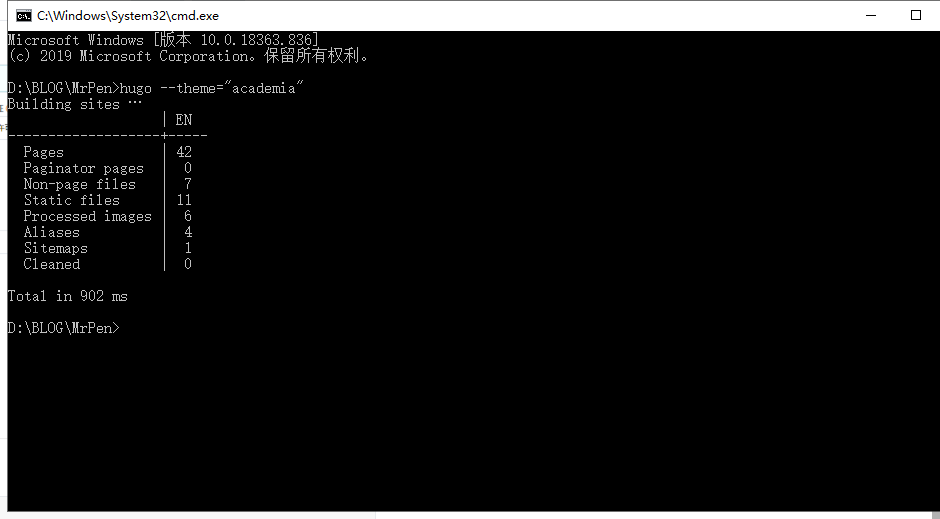
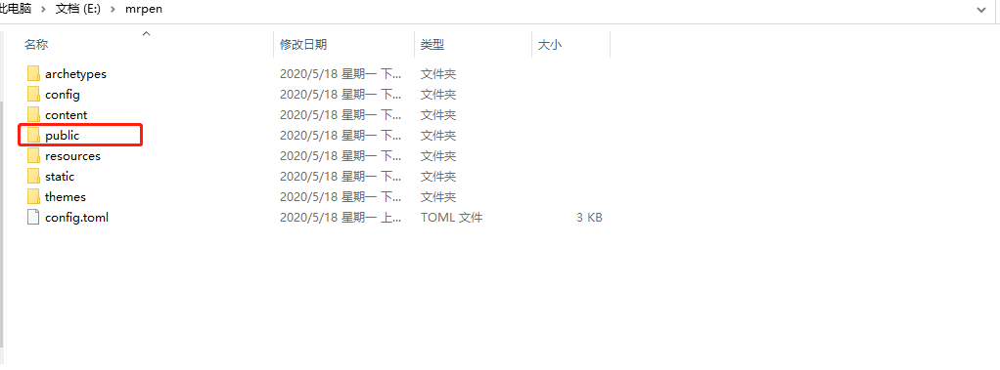
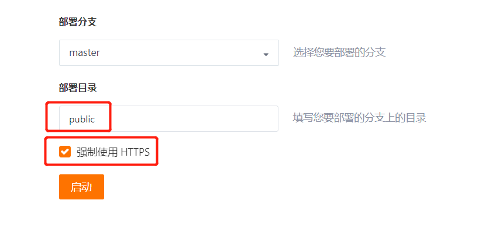

---
# Course title, summary, and position.
linktitle: 在Gitee上部署hugo个人博客
summary: Hugo是一种用Go语言编写的快速，现代化的静态网站生成器，旨在让网站创建再次变得有趣
weight: 1

# Page metadata.
title: 在Gitee上部署hugo个人博客
date: "2020-05-09T00:00:00Z"
lastmod: "2018-09-09T00:00:00Z"
draft: false  # Is this a draft? true/false
toc: true  # Show table of contents? true/false
type: docs  # Do not modify.

# Add menu entry to sidebar.
# - name: Declare this menu item as a parent with ID `name`.
# - weight: Position of link in menu.
menu:
  hugo-study:
    name: hugo
    weight: 1
---


## 前提条件  

* **创建好Gitee账号**  


* **安装好git,VCode**
* **根据[开发文档](https://gohugo.io/getting-started/quick-start/)建好HUGO站点**

  


## 简介


Hugo是一种用 `Go语言` 编写的快速，现代化的` 静态网站生成器` ，旨在让网站创建再次变得有趣。
Hugo是一个通用的网站框架。从技术上讲，Hugo是静态站点生成器。与根据每个访问者请求动态构建页面的系统不同，Hugo在创建或更新内容时会构建页面。由于浏览网站的频率远远高于编辑网站，因此Hugo旨在为您的网站的最终用户提供最佳的浏览体验，并为网站作者提供理想的写作体验。

使用Hugo构建的网站非常快速和安全。Hugo站点可以托管在任何地方，包括` Netlify` ，` Heroku` ，` GoDaddy` ，` DreamHost` ，` GitHub Pages` ，` GitLab Pages` ，` Surge` ，` Aerobatic` ，` Firebase` ，` Google Cloud Storage` ，` Amazon S3，Rackspace` ，` Azure` 和` CloudFront` ，并且可以与CDN很好地协作。Hugo网站的运行无需数据库或依赖于昂贵的运行时（如Ruby，Python或PHP）。

我们认为Hugo是理想的网站创建工具，几乎可以立即构建，并且可以在进行更改时立即进行重建。


## Gitee创建项目


注意路径最好跟用户名一致，不然到时候报`404`


## 修改baseURL


修改站点下config.toml文件的baseURL

``` bash
baseURL="https://你仓库的路径.gitee.io"
```


## 初始化站点

在站点根目录执行`hugo --theme=“你主题的名称”`

```bash
hugo --theme=academia
```


执行成功后,会在站点下会生成一个public的文件夹






## 提交Gitee托管

在站点目录下右键git Bash 依次输入如下命令（如果是第一次的话要输入gitee账号的密码）


```bash
git pull //如果不行使用: git pull --rebase origin master
git init
git remote rm origin

//改成自己的路径
git remote add origin https://XXX.com/XXXX/XXX.io.git
git add -A
git commit -m "first commit"
git push -u origin master
```
提交成功后上gitee检查，确保站点已经上传


## Gitee部署
1.点击 “服务”-->>"Gitee Pages"


2.部署目录输入“public”,勾选“强制使用HTTPS”


3.构建成功后输入链接即可访问


## 其他


启动hugo服务器

```bash
hugo server -D
```

hugo主题地址：[https://themes.gohugo.io/](https://themes.gohugo.io//)


